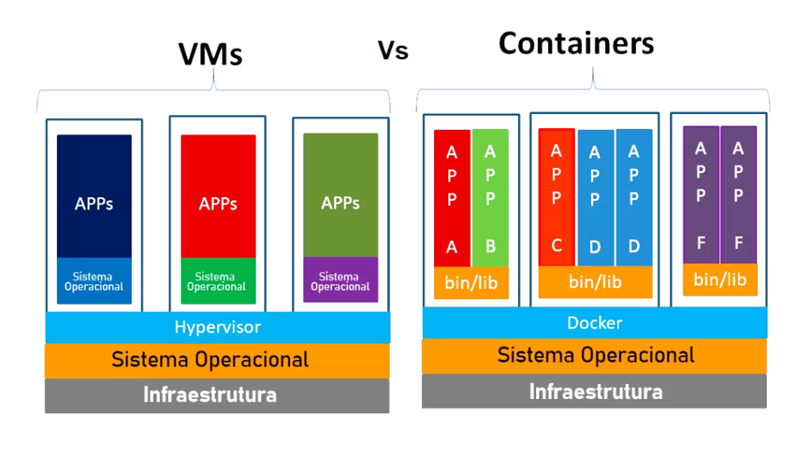

# Exemplo de Orquestração de Containers

Será demonstrado como exemplo o uso do Docker e Kubernets em um e-commerce de livros.

## Estrutura do Projeto

- `frontend`: contém o frontend da aplicação;
- `backend`: contém do backend da aplicação;
- `database`: contém o banco de dados da aplicação.

## Introdução ao Docker

Docker é uma plataforma de código aberto que permite desenvolver, enviar e executar aplicações em contêineres, ou seja, em unidades padronizadas que incluem tudo o que o software precisa para funcionar, como código, bibliotecas e ferramentas de sistema. 



### Conceitos

- `Imagem`: é um pacote de software que contém tudo o que é necessário para executar um aplicativo;
- `Container`: é uma instância em execução de uma imagem, ou seja, um ambiente isolado, leve e portátil, criado a partir de uma imagem para executar uma aplicação.

### Arquivos

- `Dockerfile`: arquivo de instruções usado para construir uma **imagem** Docker;
- `docker-compose.yaml`: arquivo de instruções usado para construir um **container** Docker;
- `.dockerignore`: arquivo de exclusão usado para informar ao Docker quais arquivos ou diretórios não devem ser copiados para a imagem.

#### Exemplo de Dockerfile
```yaml
# Baixa a última versão da imagem
FROM node

# Define o diretório de trabalho dentro do container
WORKDIR /app

# Copia os arquivos package.json e package-lock.json para dentro do container
COPY package*.json ./

# Instala os pacotes
RUN npm install

# Copia todo o restante da aplicação para dentro de /app no container
COPY . .

# Indica que o container utiliza a porta 3331
EXPOSE 3331

# Define o comando padrão que será executado ao iniciar o container
CMD ["npm", "start"]
```

#### Exemplo de docker-compose.yaml
```yaml
version: '3.9'

services:
  frontend:
    build:
      context: .
      dockerfile: Dockerfile
    image: node-ecommerce           # Nome da imagem
    container_name: frontend        # Nome do container
    ports:
      - "3331:3000"                 # HOST:APP
    volumes:
      - .:/app                      # Monta o código local (modo dev)
    command: npm run dev            # Comando de execução
```

#### Exemplo de .dockerignore
```yaml
node_modules
npm-debug.log
```

### Comandos

- `docker build -t nome-da-imagem .`: cria imagem;
- `docker run --name nome-do-container -p HOSTPORT:APPPORT nome-da-imagem`: cria o container, sendo
    - `HOSTPORT` a porta que será utilizada no host (computador) para acessar a aplicação;
    - `APPHOST` a porta em que a aplicação é disponibilizada;
- `docker stop nome-ou-id-do-container`: para a execução do container;
- `docker start nome-ou-id-do-container`: inicia a execução do container;
- `docker rm nome-ou-id-do-container`: remove o container;
- `docker-compose up --build -d`: executa os arquivos `Dockerfile` e `docker-compose.yaml`;
- `docker ps`: verifica o container em execução; 
- `docker images`: verifica a imagem node-ecommerce criada; 

### Recomendações

Quando a aplicação possui somente o arquivo `Dockerfile`, execute o comando `docker build -t nome-da-imagem .`. Caso tenha `docker-compose.yaml`, execute o comando `docker-compose up --build -d`. Este último considera os dois arquivos (`Dockerfile` e `docker-compose.yaml`).


## Observação

Embora em cada pasta do projeto tenha `Dockerfile` e `docke-compose.yaml`, o ideal é considerar o arquivo `docke-compose.yaml` na raiz do projeto. Desta forma, executa o comando `docker-compose up --build -d` somente uma vez. 