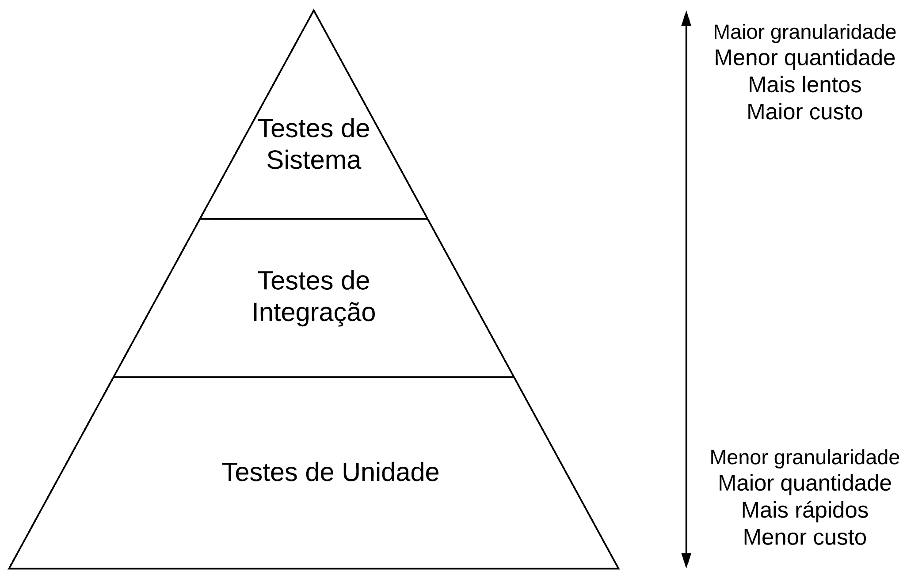

Testes de software são fundamentais para garantir qualidade, confiabilidade e evolução segura do sistema.

Eles permitem:

- detectar erros cedo
- evitar regressões, ou seja, mudanças não quebram o que já funciona
- facilitar manutenção
- documentar comportamento

Em projetos reais, software sem testes tende a se tornar difícil de manter e arriscado de evoluir.

O **TDD** é uma prática que usa testes como guia para o desenvolvimento.

Ciclo do TDD

`Red -> Green -> Refactor`

- Red: escrever um teste que falha
- Green: implementar o mínimo para passar
- Refactor: melhorar o código mantendo os testes

A pirâmide de testes define como distribuir os tipos de testes em um sistema.

- **Teste de unidade**: testa uma pequena parte isolada do sistema (ex: função ou método), sem dependências externas.
- **Teste de integração**: testa a interação entre componentes do sistema (ex: controller + service + dados).
- **Teste de sistema**: testa o sistema completo do ponto de vista do usuário, validando o **comportamento** real (ex: API via BDD).

---